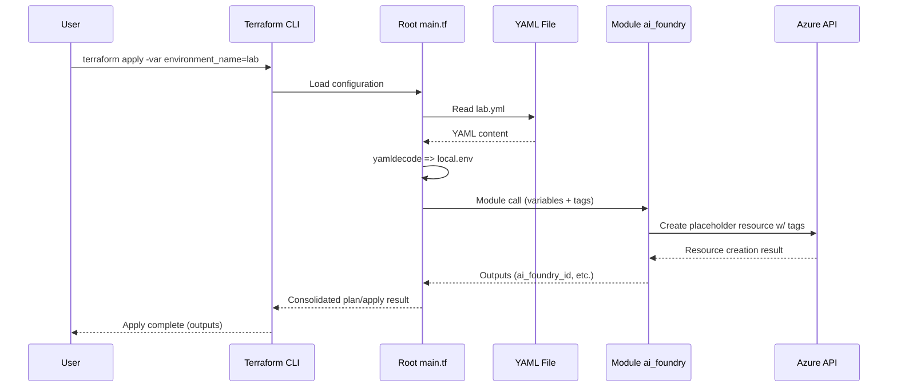
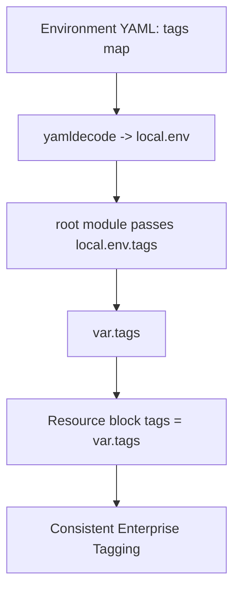
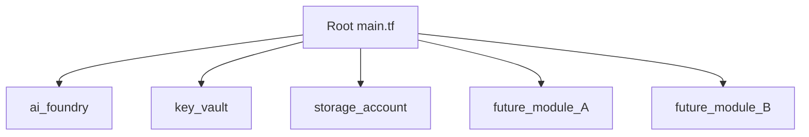

# AIB 3.0 Terraform Automation – Architecture & Flow

## 1. Overview
This document illustrates how the Terraform implementation for AIB 3.0 orchestrates Azure resource deployment using a modular repository (reusable service modules) and a root (workload) repository. It focuses on:
- Repository roles and structure
- Module anatomy (main.tf, variables.tf, outputs.tf)
- Environment-driven configuration via YAML files
- Variable and tag propagation workflow
- Execution flow from `terraform apply` through to resource creation
- Design diagrams (component, sequence, data/tag flow, module graph)

## 2. Repository Structure
### 2.1 Modules Repository (Reusable Building Blocks)
Purpose: Houses independent, versionable Terraform modules for Azure services (e.g., Key Vault, Storage Account, AI Foundry).
Contains per-module skeleton: `main.tf`, `variables.tf`, `outputs.tf` plus ancillary files.

Example Path (conceptual): `../modules/ai_foundry/`

### 2.2 Root (Workload) Repository (Orchestration Layer)
Purpose: Coordinates deployments by composing modules, loading environment-specific settings, configuring backend, providers, and passing enterprise tags.
Contains: `main.tf`, `variables.tf`, `backend.tf`, environment YAMLs under `environments/`.

### 2.3 Environment Configuration Folder
Each environment (lab, live, non-live) has a YAML file supplying naming, location, and tags. Example: `environments/lab.yml`.

## 3. Module Anatomy (Example: ai_foundry)
### 3.1 `main.tf` (Skeleton Phase)
Defines (or will define) Azure resources. Currently placeholder form:
```hcl
resource "azurerm_resource_placeholder" "example" {
  name                = var.resource_name
  resource_group_name = var.resource_group_name
  location            = var.location
  tags                = var.tags
}
```
### 3.2 `variables.tf`
Declares typed, documented inputs:
```hcl
variable "resource_group_name" {
  description = "Resource group where AI Foundry will be deployed."
  type        = string
}
variable "resource_name" {
  description = "Name of the AI Foundry resource."
  type        = string
}
variable "location" {
  description = "Azure region for deployment."
  type        = string
}
variable "tags" {
  description = "Enterprise tags applied to all resources."
  type        = map(string)
}
```
### 3.3 `outputs.tf`
Exposes resource outputs to upstream consumers:
```hcl
output "ai_foundry_id" {
  description = "ID of the AI Foundry resource."
  value       = "" # To be replaced with actual ID attribute when resource implemented
}
```

## 4. Root Repository Orchestration
### 4.1 Local YAML Decoding
Environment-specific values loaded once via `yamldecode`:
```hcl
locals {
  env = yamldecode(
    file("${path.root}/environments/${var.environment_name}.yml")
  )
}
```
### 4.2 Module Invocation
```hcl
module "ai_foundry" {
  source              = "../modules/ai_foundry"
  resource_group_name = local.env.resource_group_name
  resource_name       = local.env.ai_foundry_name
  location            = local.env.location
  tags                = local.env.tags
}
```

### 4.3 Example Environment YAML (`lab.yml`)
```yaml
resource_group_name: "rg-lab-aib"
location: "eastus"
ai_foundry_name: "lab-aifoundry"
key_vault_name: "lab-keyvault"
tags:
  environment: "lab"
  owner: "Vodafone-AI"
  cost_center: "CC1234"
  project: "AIB-3.0"
```

## 5. Variable & Tag Flow (Conceptual)
1. Tags defined per environment in `environments/<env>.yml`.
2. Root `main.tf` decodes YAML => `local.env` map.
3. Root passes `local.env.tags` into each module as `var.tags`.
4. Module resources consume `var.tags`, ensuring consistent enterprise tagging.

## 6. Design Diagrams
### 6.1 Component Overview
```mermaid
flowchart LR
  subgraph ENV[Environment Config]
    YML_LAB[lab.yml]
    YML_LIVE[live.yml]
    YML_NONLIVE[non-live.yml]
  end
  subgraph ROOT[Root / Workload Repo]
    MAIN_ROOT[main.tf]
    LOCALS[locals (yamldecode)]
    VARS_ROOT[variables.tf]
  end
  subgraph MODS[Modules Repo]
    MF_AI[ai_foundry]
    MF_KV[key_vault]
    MF_STORAGE[storage_account]
  end
  subgraph AZ[Azure Resources]
    R_AI[AI Foundry Resource]
    R_KV[Key Vault]
    R_STOR[Storage Account]
  end

  YML_LAB --> LOCALS
  YML_LIVE --> LOCALS
  YML_NONLIVE --> LOCALS
  LOCALS --> MAIN_ROOT
  MAIN_ROOT --> MF_AI
  MAIN_ROOT --> MF_KV
  MAIN_ROOT --> MF_STORAGE
  MF_AI --> R_AI
  MF_KV --> R_KV
  MF_STORAGE --> R_STOR
```

### 6.2 Sequence (Apply Lifecycle)


### 6.3 Tag & Data Flow Focus


### 6.4 Module Invocation Graph (Extensible)


## 7. Execution Narrative
- User triggers `terraform apply` with selected `environment_name`.
- Root loads matching YAML and builds `local.env` (single source of truth for naming, location, tags).
- Each declared module receives a curated slice of `local.env` variables.
- Tags flow unchanged from YAML to resource blocks for audit and governance alignment.
- Modules emit outputs enabling downstream composition (e.g., referencing Key Vault IDs in other modules).

## 8. Extensibility & Governance
| Concern | Current Approach | Future Enhancement |
|---------|------------------|--------------------|
| Tag Consistency | Central YAML definition | Policy as Code validation (OPA / Sentinel) |
| Module Versioning | Relative path source during skeleton phase | Promote to registry with version pinning |
| Secrets | Not yet implemented | Inject from secure variable store / Key Vault data source |
| Observability | Placeholder telemetry files | Add diagnostic settings module + outputs |

## 9. Example End-to-End Snippet (Root + Module Union)
```hcl
# variables.tf (root)
variable "environment_name" {
  type        = string
  description = "Deployment environment (lab | live | non-live)."
}

# main.tf (root)
locals {
  env = yamldecode(file("${path.root}/environments/${var.environment_name}.yml"))
}
module "ai_foundry" {
  source              = "../modules/ai_foundry"
  resource_group_name = local.env.resource_group_name
  resource_name       = local.env.ai_foundry_name
  location            = local.env.location
  tags                = local.env.tags
}
output "ai_foundry_id" {
  description = "Forwarding module output once implemented"
  value       = module.ai_foundry.ai_foundry_id
}
```

## 10. Design Principles Applied
- Separation of concerns: environment config vs deployment logic vs resource definition.
- Reusability: modules are portable and environment-agnostic except for passed variables.
- Centralized governance: enterprise tags managed once per environment.
- Extensibility: adding a new service involves creating a module folder + invoking it from root.
- Transparency: YAML-driven inputs make non-technical review easier.

## 11. Future Recommendations
1. Introduce version pinning (e.g., Terraform Registry or Git tags) for stability.
2. Implement validation layer: schema check of YAML before decode.
3. Add standardized outputs (IDs, names, URIs) across all modules for cross-module wiring.
4. Enforce tagging completeness with pre-commit hooks.
5. Integrate cost estimation (e.g., Infracost) post-plan using module outputs.

## 12. Quick Start (Operational)
```bash
terraform init
terraform plan -var environment_name=lab
terraform apply -var environment_name=lab
```
(Adjust backend/providing configuration as required.)

## 13. Summary
This architecture ensures a clean, scalable Terraform implementation for AIB 3.0: environment-driven inputs, consistent tagging, reusable modules, and clear layering. The provided diagrams offer multiple viewpoints (structural, behavioral, data-centric) to accelerate onboarding and future extension.

---
Document version: 1.0 | Status: Skeleton Implementation Stage
