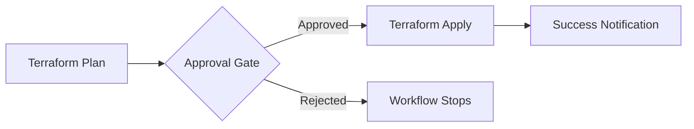

# 🚀 Multi-Environment Terraform Pipeline Setup Guide

This document provides step-by-step instructions for setting up and using the automated multi-environment Terraform deployment pipeline.

## 📋 Table of Contents
1. [Prerequisites](#prerequisites)
2. [GitHub Repository Setup](#github-repository-setup)
3. [Environment Configuration](#environment-configuration)
4. [Running the Workflows](#running-the-workflows)
5. [Branch Strategy & Workflow Triggers](#branch-strategy--workflow-triggers)
6. [Approval Gates Configuration](#approval-gates-configuration)
7. [Troubleshooting](#troubleshooting)

## 🔧 Prerequisites

### 1. Azure Service Principal
Create a service principal with sufficient permissions:

```bash
# Create service principall
az ad sp create-for-rbac --name "terraform-pipeline" --role "Contributor" --scopes "/subscriptions/YOUR_SUBSCRIPTION_ID"
```

### 2. Required Permissions
- **Contributor** role on the target subscription
- **Key Vault Contributor** for Key Vault operations
- **Storage Account Contributor** for Storage operations

### 3. GitHub Repository Requirements
- Repository with Admin permissions
- GitHub Pro/Team/Enterprise for Environment protection rules

## ⚙️ GitHub Repository Setup

### Step 1: Create Repository Secrets

Go to **Settings → Secrets and variables → Actions** and add these secrets:

| Secret Name | Value | Description |
|-------------|-------|-------------|
| `AZURE_CLIENT_ID` | `your-service-principal-id` | Service Principal Application ID |
| `AZURE_CLIENT_SECRET` | `your-service-principal-secret` | Service Principal Secret |
| `AZURE_SUBSCRIPTION_ID` | `your-subscription-id` | Azure Subscription ID |
| `AZURE_TENANT_ID` | `your-tenant-id` | Azure Tenant ID |

> 📝 **Note**: `GITHUB_TOKEN` is automatically provided by GitHub Actions.

### Step 2: Create GitHub Environments

Go to **Settings → Environments** and create these environments:

#### Basic Environments (No Approval Required)
- `lab`
- `nlv` 
- `lv`

#### Apply Environments (Approval Required) 🔒
- `lab-apply`
- `nlv-apply` 
- `lv-apply`

#### Destroy Environments (Approval Required) ⚠️
- `lab-destroy`
- `nlv-destroy`
- `lv-destroy`

### Step 3: Configure Environment Protection Rules

For each `-apply` and `-destroy` environment:

#### LAB Environment (`lab-apply`, `lab-destroy`)
- ✅ **Required reviewers**: 1 person (DevOps team member)
- ✅ **Wait timer**: 2 minutes
- ❌ **Prevent administrators from bypassing**: No

#### NLV Environment (`nlv-apply`, `nlv-destroy`)  
- ✅ **Required reviewers**: 2 people (Team Lead + DevOps)
- ✅ **Wait timer**: 5 minutes
- ✅ **Prevent administrators from bypassing**: Yes

#### LV/Production Environment (`lv-apply`, `lv-destroy`)
- ✅ **Required reviewers**: 3 people (Team Lead + Manager + Senior DevOps)
- ✅ **Wait timer**: 15 minutes (apply) / 30 minutes (destroy)
- ✅ **Prevent administrators from bypassing**: Yes

### Step 4: Configure Branch Protection Rules

Go to **Settings → Branches** and add protection rules:

#### `main` branch
- ✅ Require a pull request before merging
- ✅ Require approvals (2)
- ✅ Require review from CODEOWNERS
- ✅ Require status checks to pass
- ✅ Require branches to be up to date before merging

#### `staging` branch  
- ✅ Require a pull request before merging
- ✅ Require approvals (1)
- ✅ Require status checks to pass

## 🏗️ Environment Configuration

The pipeline uses YAML files to define environment-specific configurations:

### LAB Environment (`environments/lab-customer-config.yml`)
```yaml
environment: lab
location: "East US"
resources:
  resource_group:
    enabled: true
    name: "rg-lab-demo"
  storage_account:
    enabled: true
    name: "labsa001"
  key_vault:
    enabled: true
    name: "lab-kv-testing"
```

### NLV Environment (`environments/nlv-customer-config.yml`)
```yaml
environment: non-live
location: "East US"
resources:
  resource_group:
    enabled: true
    name: "rg-non-live-demo"
  storage_account:
    enabled: true
    name: "nonlivesa003"
  key_vault:
    enabled: true
    name: "nonlive-kv-testing"
```

### LV/Production Environment (`environments/lv-customer-config.yml`)
```yaml
environment: live
location: "East US"
resources:
  resource_group:
    enabled: true
    name: "rg-live-demo"
  storage_account:
    enabled: true
    name: "livesa002"
  key_vault:
    enabled: true
    name: "live-kv-testing"
```

## 🚀 Running the Workflows

### Automated Workflow Journey

#### 1. 👨‍💻 Developer Creates Feature Branch

```bash
# Create and switch to feature branch
git checkout -b feature/add-storage-encryption

# Make your changes to Terraform files
# ... edit files ...

# Commit and push
git add .
git commit -m "Add storage account encryption"
git push origin feature/add-storage-encryption
```

**What happens:** 
- ✅ Triggers `deploy-feature.yml` workflow
- ✅ Validates Terraform code
- ✅ Plans deployment for LAB environment
- ✅ Automatically deploys to LAB (no approval needed)
- 🤖 **Auto-creates PR to `staging` branch**

#### 2. 🔄 Team Lead Reviews and Merges to Staging

- Navigate to the auto-created PR
- Review the changes and deployment results
- Approve and merge to `staging` branch

**What happens:**
- ✅ Triggers `deploy-staging.yml` workflow  
- ✅ Validates and plans for NLV environment
- ⏸️ **Pauses for approval** (approval gate activated!)
- ✅ After approval, deploys to NLV
- 🤖 **Auto-creates PR to `main` branch**
- 🗑️ **Auto-deletes the feature branch**

#### 3. 🏭 Manager Reviews and Merges to Main (Production)

- Navigate to the auto-created PR to main
- Review all deployment history
- Approve and merge to `main` branch

**What happens:**
- ✅ Triggers `deploy-main.yml` workflow
- ✅ Validates and plans for LV (Production)
- ⏸️ **Pauses for multiple approvals** (strict approval gate!)
- ✅ After approvals, deploys to Production
- 🎉 **Creates deployment success notification**
- 📊 **Generates deployment report**

### Manual Workflows

#### Combined Pipeline (Manual Control)

Use this for testing or emergency deployments:

1. Go to **Actions** → **Combined Multi-Environment Pipeline**
2. Click **Run workflow**
3. Select:
   - **Environment**: `lab`, `nlv`, or `lv`
   - **Action**: `validate`, `plan`, `apply`, or `destroy`  
   - **Reason**: Describe why you're doing this manually

#### Manual Destroy

To destroy infrastructure in any environment:

1. Go to **Actions** → Select the appropriate workflow:
   - `deploy-feature.yml` for LAB
   - `deploy-staging.yml` for NLV
   - `deploy-main.yml` for LV
2. Click **Run workflow**
3. The destroy job will trigger with approval gates

## 📊 Branch Strategy & Workflow Triggers

### Branch Structure

```
main                    🏭 Production (LV)
├── staging             🔄 Non-Live (NLV) 
    ├── feature/user-auth   🧪 LAB
    ├── feature/api-update  🧪 LAB
    └── feature/ui-changes  🧪 LAB
```

### Workflow Trigger Matrix

| Branch Pattern | Workflow | Environment | Approval Gates | Auto-PR Target |
|---------------|----------|-------------|----------------|----------------|
| `feature/**` | `deploy-feature.yml` | LAB | ❌ None | → `staging` |
| `staging` | `deploy-staging.yml` | NLV | ✅ 1 Gate | → `main` |
| `main` | `deploy-main.yml` | LV/PROD | ✅ 2 Gates | ❌ None |

### Pipeline Job Structure

Each workflow follows this pattern:

```
Job 1: terraform-validate ✅
  ↓
Job 2: terraform-plan 📋
  ↓  
Job 3: terraform-apply 🚀 (with approval gate 🔒)
  ↓
Job 4: create-next-pr 🤖 (auto-promotion)
  ↓
Job 5: cleanup 🗑️ (branch deletion)
```

### Approval Gate Locations

Approval gates are implemented at the **JOB level**, not workflow level:

```yaml
jobs:
  terraform-apply:
    runs-on: ubuntu-latest
    environment: ${{ inputs.environment }}-apply  # 🔒 This creates the gate
```

**When approval is required:**
1. Workflow pauses at the `terraform-apply` job
2. GitHub sends notifications to configured reviewers
3. Reviewers can see:
   - Terraform plan output
   - Environment details
   - Deployment history
4. After approval, job continues with `terraform apply`

## 🔒 Approval Gates Configuration

### How Approval Gates Work



### Approval Gate Hierarchy

| Environment | Apply Approvals | Destroy Approvals | Wait Time |
|-------------|----------------|-------------------|-----------|
| LAB | None | 1 (DevOps) | 2 min |
| NLV | 2 (Lead + DevOps) | 2 (Lead + DevOps) | 5 min |
| LV/PROD | 3 (Lead + Manager + Senior) | 3 + Director | 15-30 min |

### Setting Up Reviewers

1. Go to **Settings → Environments → [environment-name]**
2. Check **Required reviewers** 
3. Add reviewers by GitHub username or team
4. Set **Wait timer** for additional safety
5. Configure **Deployment branches** if needed

## 🎯 Complete Workflow Examples

### Example 1: New Feature Development

```bash
# Developer workflow
git checkout main
git pull origin main
git checkout -b feature/add-monitoring

# Make changes
echo "# Add monitoring" >> monitoring.tf
git add .
git commit -m "Add monitoring infrastructure"
git push origin feature/add-monitoring

# 🤖 Automatic process starts:
# 1. LAB deployment (immediate)
# 2. PR created to staging (automatic)  
# 3. Team lead merges to staging
# 4. NLV deployment (with approval)
# 5. PR created to main (automatic)
# 6. Manager approves production deployment
# 7. LV deployment (with multiple approvals)
# 8. Feature branch deleted (automatic)
```

### Example 2: Emergency Hotfix

```bash
# For urgent production fixes
git checkout main
git checkout -b hotfix/security-patch

# Make critical changes
# ... fix security issue ...
git add .
git commit -m "Security hotfix"
git push origin hotfix/security-patch

# Follow same automated workflow but with urgency
# Can also use manual pipeline for faster deployment if needed
```

### Example 3: Manual Testing

Use the **Combined Pipeline** for manual testing:

1. **Actions** → **Combined Multi-Environment Pipeline** → **Run workflow**
2. Select:
   - Environment: `lab`
   - Action: `apply` 
   - Reason: "Testing new storage configuration"
3. Monitor the deployment
4. When done, run again with Action: `destroy`

## 🚦 Monitoring and Notifications

### Where to Monitor Deployments

1. **GitHub Actions Tab**: Real-time workflow progress
2. **Pull Requests**: Auto-generated PRs with deployment status
3. **Issues**: Deployment success/failure notifications
4. **Artifacts**: Deployment reports and Terraform plans

### Notification Points

- 📧 **Email notifications** for approval requests
- 💬 **PR comments** with Terraform plan outputs
- 🎉 **Issue creation** for successful deployments
- ⚠️ **Issue creation** for failed deployments

## 🔧 Troubleshooting

### Common Issues

#### 1. Workflow Not Triggering
**Problem**: Push to feature branch doesn't trigger workflow
**Solution**: 
- Check branch name starts with `feature/`
- Verify workflow file syntax
- Check repository permissions

#### 2. Approval Gate Not Working
**Problem**: Apply job runs without approval
**Solution**:
- Check environment name in workflow matches GitHub environment
- Verify environment protection rules are enabled
- Check reviewer permissions

#### 3. Auto-PR Not Created
**Problem**: No PR created after successful deployment
**Solution**:
- Verify `GITHUB_TOKEN` permissions
- Check target branch exists (`staging` or `main`)
- Review PR creation step logs

#### 4. Terraform Plan Fails
**Problem**: Plan fails with authentication errors
**Solution**:
- Verify Azure secrets are correct
- Check service principal permissions
- Confirm subscription ID is correct

#### 5. Module Not Found
**Problem**: Terraform can't find module source
**Solution**:
- Verify module repository path
- Check module repository access permissions
- Consider using versioned module sources

### Debug Steps

1. **Check workflow logs** in Actions tab
2. **Verify environment configuration** files
3. **Test Azure authentication** manually
4. **Validate Terraform syntax** locally
5. **Check approval gates** in Environment settings

### Emergency Procedures

#### Emergency Rollback
1. Use **Combined Pipeline** with `destroy` action
2. Or manually revert changes and redeploy
3. Or use Terraform state manipulation (advanced)

#### Bypass Approval (Emergency Only)
1. Temporarily disable environment protection rules
2. Run emergency deployment
3. **Immediately re-enable protection rules**
4. Document emergency action in issue

## 🎓 Best Practices

### 1. Branch Naming
- ✅ `feature/description` - triggers LAB deployment
- ✅ `hotfix/description` - for urgent fixes
- ❌ `dev/description` - won't trigger workflows

### 2. Commit Messages
- Be descriptive about infrastructure changes
- Mention impact on each environment
- Reference issue numbers when applicable

### 3. PR Reviews
- Always review Terraform plan outputs in PR comments
- Verify environment-specific configurations
- Check for breaking changes

### 4. Approval Process
- LAB: Fast feedback, minimal approval
- NLV: Staging validation, team review
- LV: Production safety, multiple approvals

### 5. Manual Interventions
- Use Combined Pipeline for testing
- Document manual actions in GitHub issues
- Always clean up test resources

## 📚 Additional Resources

- [Terraform Azure Provider Documentation](https://registry.terraform.io/providers/hashicorp/azurerm/latest/docs)
- [GitHub Actions Workflow Syntax](https://docs.github.com/en/actions/learn-github-actions/workflow-syntax-for-github-actions)
- [GitHub Environment Protection Rules](https://docs.github.com/en/actions/deployment/targeting-different-environments/using-environments-for-deployment)

---

## 🚀 Quick Start Checklist

- [ ] ✅ Azure Service Principal created
- [ ] 🔐 GitHub secrets configured  
- [ ] 🏠 GitHub environments created
- [ ] 🔒 Approval gates configured
- [ ] 🌿 Branch protection rules set
- [ ] 📝 Environment YAML files configured
- [ ] 🧪 Test feature branch created
- [ ] 🚀 First deployment successful

**You're ready to deploy! 🎉**