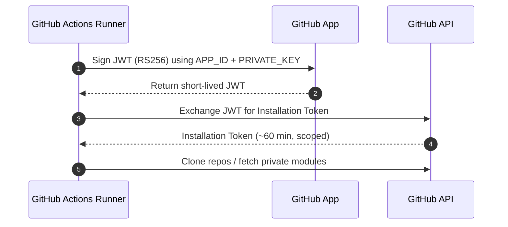

# GitHub Apps: How They Work (CI usage)

This doc explains how GitHub Apps authenticate and how we use them in CI to access repositories and private Terraform modules.

## What is a GitHub App?
- An application identity installed on an org/repo.
- Issues short‑lived “installation tokens” with least‑privilege, scoped to the installation.
- Auth flow: sign a JWT with App private key → exchange for installation access token.

## Why short‑lived installation tokens?
- Reduce risk compared to long‑lived static secrets.
- Permissions are scoped to exactly the repos/operations required.

## How the Auth Flow Works


## App Permissions (typical minimal set)
- Repository contents: Read (clone, module fetch)
- Pull requests: Write (only if the workflow creates PRs)
- Avoid broad scopes; grant per‑repo where possible.

## Secrets required in CI
- `APP_ID`: App identifier
- `PRIVATE_KEY`: App private key (PEM)
- `INSTALLATION_ID`: Installation id for the org/repo

## How We Use It in Workflows
- Mint token with `tibdex/github-app-token@v2`.
- Configure git so Terraform can fetch private modules.

Example snippet:
```yaml
- name: Generate GitHub App Token
  id: app-token
  uses: tibdex/github-app-token@v2
  with:
    app_id: ${{ secrets.APP_ID }}
    private_key: ${{ secrets.PRIVATE_KEY }}
    installation_id: ${{ secrets.INSTALLATION_ID }}

- name: Configure Git for Private Terraform Modules
  run: |
    git config --global url."https://x-access-token:${{ steps.app-token.outputs.token }}@github.com/".insteadOf "https://github.com/"
```

## Lifecycles & Rotation
- Tokens expire automatically (approx. 60 minutes).
- Rotate the App private key periodically and update CI secret.

## Troubleshooting
- 401/403 fetching modules → check App permissions and that token is minted in the job.
- Token expiration mid‑job → ensure token creation happens close to clone/plan steps.
- Private modules across multiple repos → install the App on each required repo.

## Azure Note (context)
- GitHub App is only for GitHub access.
- Azure authentication uses a Service Principal via `azure/login@v1`; Terraform uses resulting ARM tokens.
