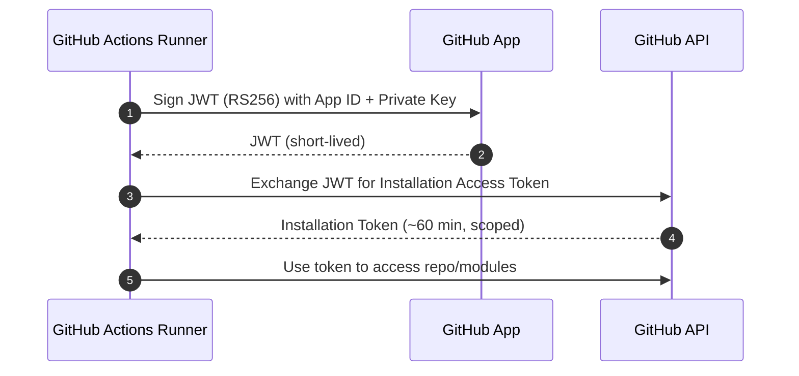
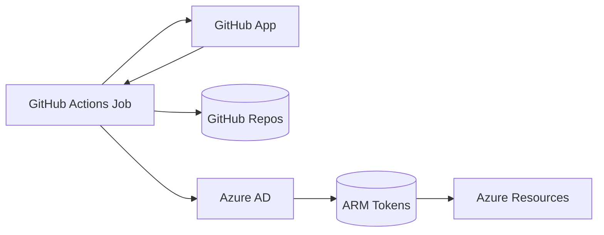
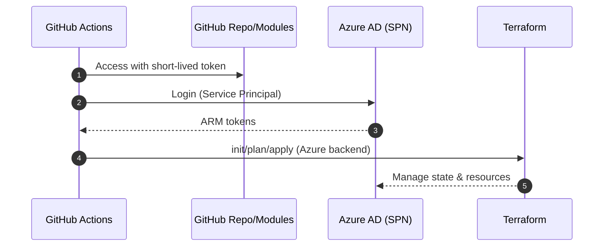

# GitHub Apps: Secure CI/CD with Azure SPN

This doc focuses only on how GitHub Apps are used in CI/CD with an Azure Service Principal (SPN) for Terraform operations.

## GitHub App Authentication Flow

Key properties:
- Short‑lived, scoped installation tokens.
- Only the App private key is stored as an encrypted secret.

---
## Azure Authentication (SPN)

CI logs into Azure using a Service Principal; Terraform then uses ARM tokens for backend state and resource provisioning.

Diagram: Dual‑auth (GitHub App for repo access; SPN for Azure)

Benefits:
- Separation of concerns (GitHub vs Azure).
- Least privilege (scoped repo access + scoped Azure role assignments).

---
## Workflow Usage

Actions used:
- `tibdex/github-app-token@v2` (mint installation token)
- `azure/login@v1` (Azure SPN login)
- `hashicorp/setup-terraform@v3` (Terraform CLI)

Steps:
1. Generate installation token.
2. Configure `git` for private module access.
3. Azure login with SPN.
4. Terraform init/plan/apply.

Diagram: CI Flow

Secrets required:
- `APP_ID`, `PRIVATE_KEY`, `INSTALLATION_ID` (GitHub App)
- Azure SPN: `AZURE_AD_CLIENT_ID`, `AZURE_AD_CLIENT_SECRET`, `AZURE_SUBSCRIPTION_ID`, `AZURE_AD_TENANT_ID`

End of doc.
