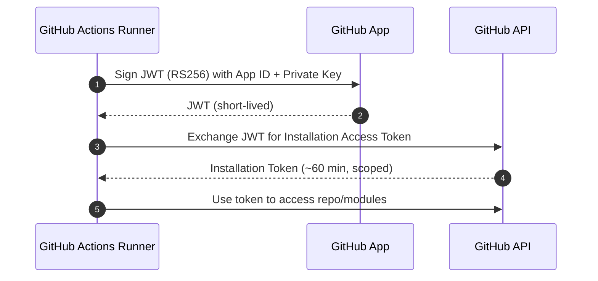
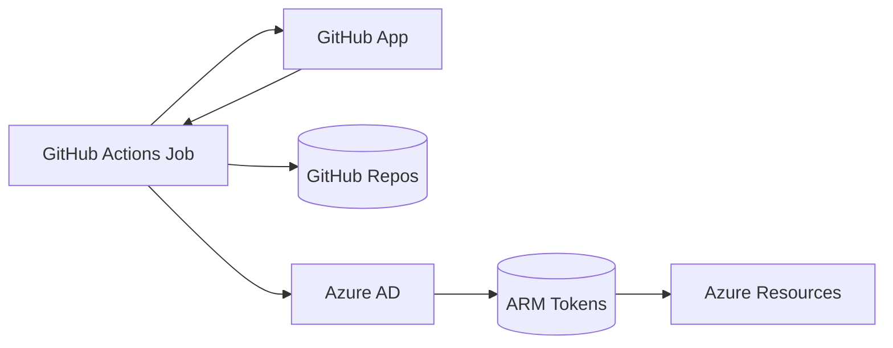
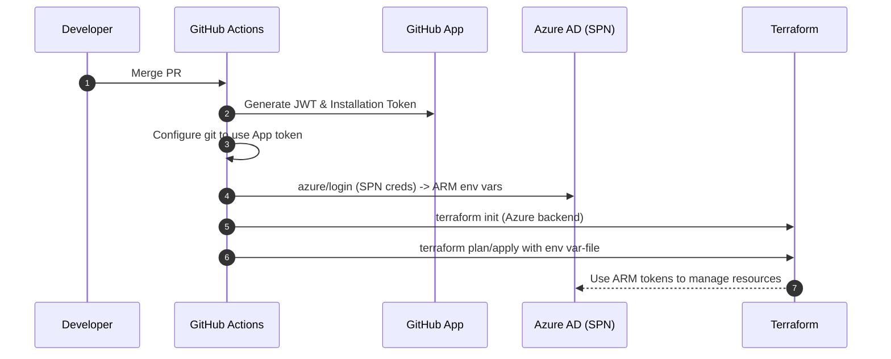
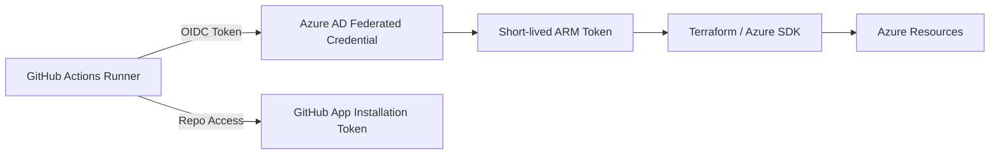

# GitHub Apps vs PAT: Secure CI/CD with Azure SPN

This guide explains why GitHub Apps are preferred over personal access tokens (PATs), and how our pipelines authenticate using a GitHub App alongside an Azure Service Principal (SPN).

---
## Why GitHub Apps Are Better Than PATs

- Security: GitHub Apps use short‑lived installation tokens minted via signed JWTs; PATs are long‑lived static secrets tied to a user.
- Least privilege: App permissions are scoped to repos/organizations; PATs inherit broad user scopes.
- Revocation: Rotate private keys without user disruption; revoke installations granularly. PAT compromise disables a user’s access broadly.
- Auditability: Actions performed by Apps are attributed to the App installation; PATs blur actor identity and use the user context.
- Automation fit: Apps are designed for machine‑to‑machine access; PATs are for user‑initiated API calls.

---
## Authentication Flow (High Level)

Diagram: GitHub App token minting and use in Actions



Key properties:
- Tokens are short‑lived and scoped to the installation.
- No user PAT stored; only the App private key is maintained as a secret.

---
## Azure Authentication with SPN (Service Principal)

We use Azure SPN credentials to authenticate to Azure in CI jobs (login & Terraform). The SPN is independent of GitHub identities.

Diagram: Dual‑auth (GitHub App for code; SPN for Azure)


Benefits:
- Clear separation of concerns: GitHub App for GitHub; SPN for Azure.
- Least privilege: App only needs repo read (and PR write when required); SPN is scoped to Azure subscription/resource group.

---
## How Our Workflows Implement This

We use these actions:
- `tibdex/github-app-token@v2` to mint installation tokens from the App.
- `azure/login@v1` to authenticate with the Azure SPN.
- `hashicorp/setup-terraform@v3` for Terraform commands.

Snippet (from reusable workflows):
```yaml
- name: Generate GitHub App Token
  id: app-token
  uses: tibdex/github-app-token@v2
  with:
    app_id: ${{ secrets.APP_ID }}
    private_key: ${{ secrets.PRIVATE_KEY }}
    installation_id: ${{ secrets.INSTALLATION_ID }}

- name: Configure Git for Private Terraform Modules
  run: |
    git config --global url."https://x-access-token:${{ steps.app-token.outputs.token }}@github.com/".insteadOf "https://github.com/"

- name: Azure Login
  uses: azure/login@v1
  with:
    creds: '{"clientId":"${{ secrets.AZURE_AD_CLIENT_ID }}","clientSecret":"${{ secrets.AZURE_AD_CLIENT_SECRET }}","subscriptionId":"${{ secrets.AZURE_SUBSCRIPTION_ID }}","tenantId":"${{ secrets.AZURE_AD_TENANT_ID }}"}'
```

---
## Permissions and Secrets

- GitHub App permissions:
  - Repository contents: Read (for cloning and module fetch).
  - Pull requests: Write (only if creating PRs from pipelines).
- Secrets required in the repo/org:
  - `APP_ID`, `PRIVATE_KEY`, `INSTALLATION_ID` for the GitHub App.
  - `AZURE_AD_CLIENT_ID`, `AZURE_AD_CLIENT_SECRET`, `AZURE_SUBSCRIPTION_ID`, `AZURE_AD_TENANT_ID` for Azure SPN.

Rotation:
- Rotate App private key regularly; update `PRIVATE_KEY` secret.
- Use Azure Key Vault or OIDC for SPN secret management where possible.

---
## Threat Model Comparison

| Aspect                | GitHub App                          | PAT                                     |
|-----------------------|-------------------------------------|-----------------------------------------|
| Token lifetime        | Short‑lived installation tokens      | Long‑lived until manually revoked       |
| Scope                 | Installation‑scoped permissions      | User‑wide scopes                        |
| Blast radius          | Single app/install                   | Entire user account repos/orgs          |
| Rotation              | Key rotation, token auto‑expiry      | Manual rotation across all consumers    |
| Audit logs            | App‑attributed with installation     | User‑attributed, mixed automation noise |
| Best for              | CI/CD, bots, automation              | User scripts, admin tasks               |

---
## End‑to‑End Flow (Terraform Plan/Apply)



---
## Recommended Hardening

- Use environment protection rules for `apply`/`destroy` jobs with approvals.
- Scope SPN to exact subscription/resource group and enforce least privilege (e.g., `Contributor` on RG or custom role).
- Prefer OIDC‑based Azure federated credentials over client secrets when possible (removes stored secrets; uses ephemeral tokens).
- Keep the GitHub App permissions minimal; split responsibilities across multiple Apps if necessary.
- Store App private key securely (e.g., Actions Encrypted Secret; rotate periodically).

---
## Diagram: OIDC Upgrade Path (Optional)



This replaces the SPN client secret with a trust relationship, improving secret hygiene.

---
## References

- GitHub: About authentication with a GitHub App
- GitHub Actions: OIDC with cloud providers
- Azure: Create service principals and federated credentials
- HashiCorp: Terraform AzureRM provider authentication options
