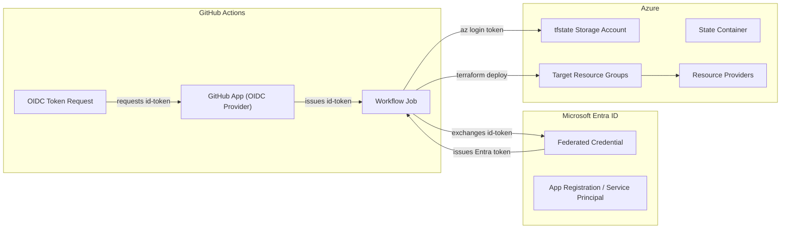
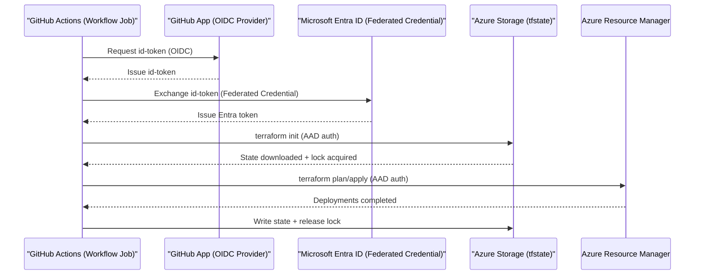

# Github - Azure Authentication Mechanism

Short, clear explanation of how authentication works with no secrets.

## How This Works
- The pipeline gets a Microsoft Entra ID token via:
  - OIDC workload identity (GitHub App federated credential).
- Terraform uses this token for both:
  - Remote state in Azure Storage (reads/writes + locking), and
  - Deployments with the `azurerm` provider.
- No access keys and no client secrets are stored.

## Architecture (High Level)

Flow used:
1. GitHub Actions OIDC federation (hosted CI)

## Required RBAC (Essentials)
- Storage Blob Data Contributor on the tfstate Storage Account (enables state reads/writes + locks).
- Contributor on the target Resource Group for deployments (prefer RG scope over subscription).

## Important Terraform Lines
- In `backend "azurerm"`: `use_azuread_auth = true`
- In `provider "azurerm"`: `storage_use_azuread = true`

## Pipeline Behavior
- CI supplies a Microsoft Entra token automatically via GitHub App OIDC. No secrets or access keys are stored or injected.
- Subscription/tenant context comes from the pipeline; Terraform uses the current login context for both backend and provider.

## GitHub Apps OIDC Provider (Definition)
- The OIDC provider is part of GitHub Apps that issues an OpenID Connect id-token to a workflow job running on GitHub Actions runners.
- The workflow exchanges this id-token with Microsoft Entra (via a Federated Credential) to obtain an access token used by Terraform.
- This is fully secretless: tokens are short‑lived and derived at runtime; no client secrets or access keys are stored.

 

## Flow Sequence (End-to-End)
1. Pipeline requests an Entra token (OIDC or Managed Identity).
2. Terraform backend uses the token to read/lock state in Azure Storage.
3. The `azurerm` provider uses the same token to call Azure Resource Manager.
4. Modules deploy resources under the assigned RBAC (Contributor at RG scope).
5. State updates are written; the lock is released.

## CI Workflow (Plan → Apply)
1. Checkout repo and select environment workspace (`lab`, `non-live`, `live`).
2. Pipeline authenticates via GitHub App OIDC — token is supplied automatically.
3. `terraform init` — backend uses Entra token (AAD) for state.
4. `terraform plan` — acquires state lock; shows changes.
5. Manual approval (optional) — gate before apply.
6. `terraform apply` — deploys under `Contributor` role at RG scope.
7. State is updated and lock released.

## Environments & State Keys
- Each environment (`lab`, `non-live`, `live`) maps to a Terraform workspace and distinct state key (e.g., `lab/terraform.tfstate`).

That’s it. The pipeline supplies the token; Terraform uses it for state and deployments under the assigned RBAC.

